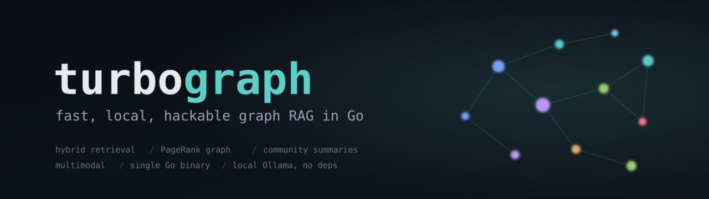
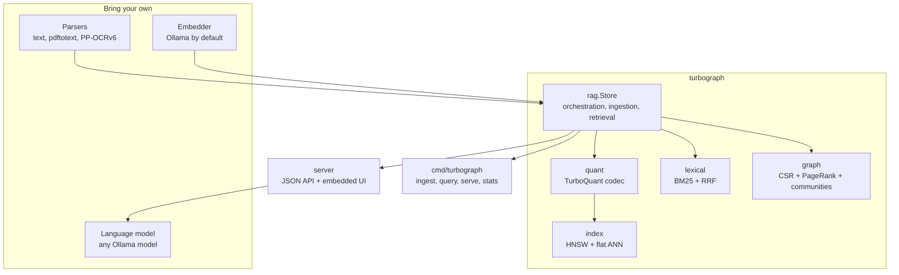
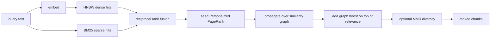
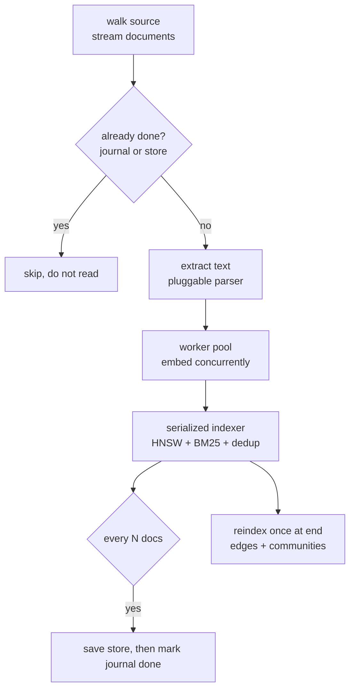
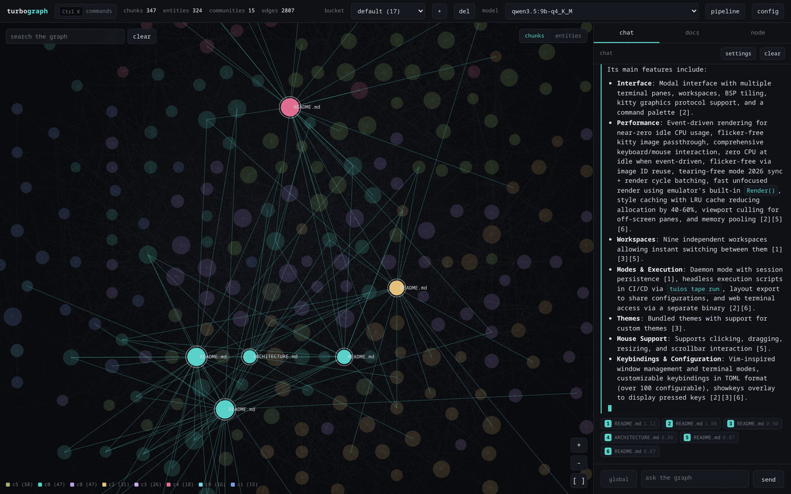
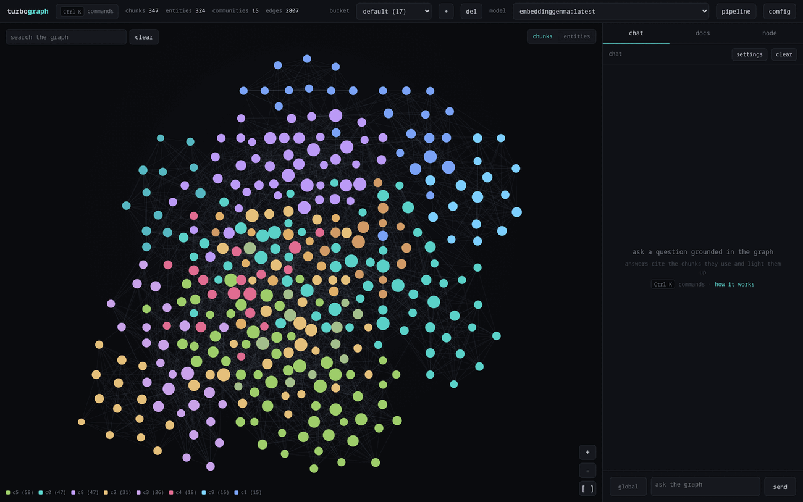
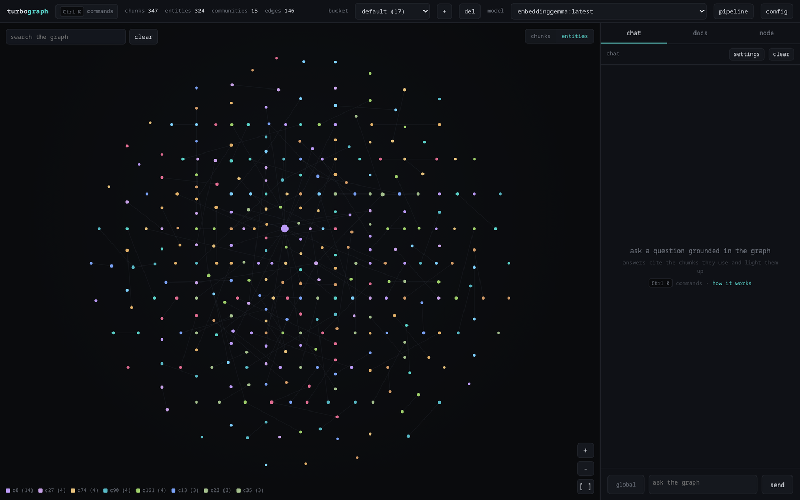
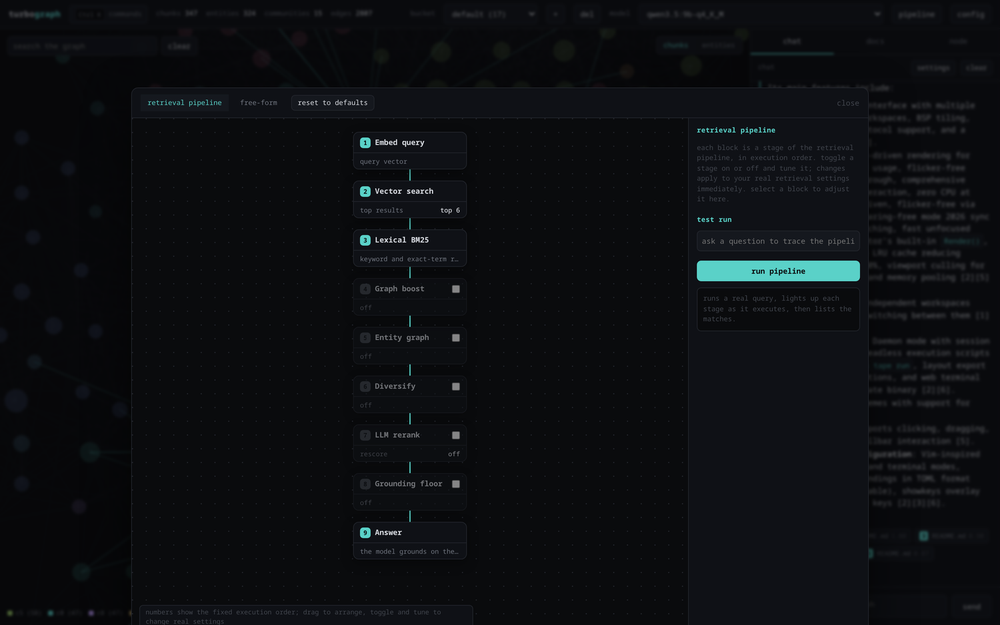
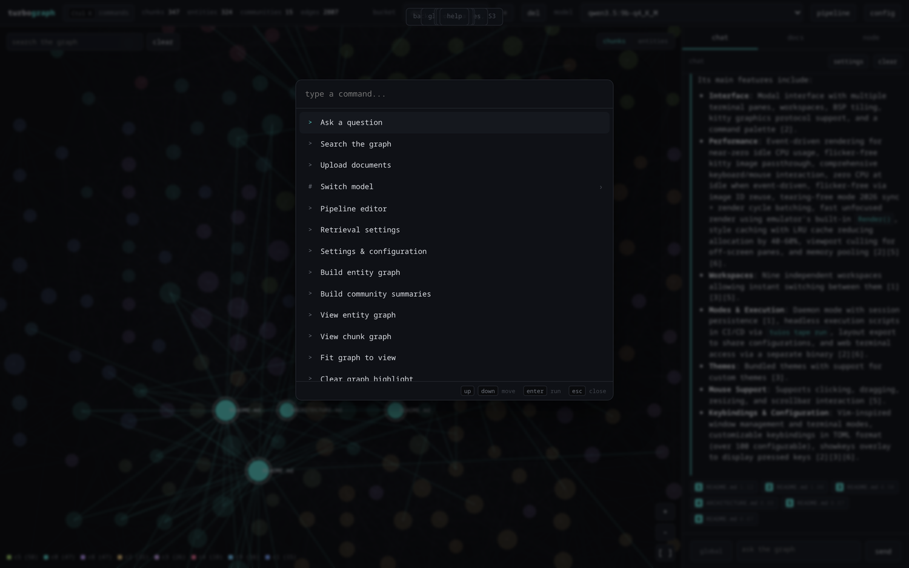

<p align="center">
  
</p>

# turbograph

[](https://github.com/Gaurav-Gosain/turbograph/actions/workflows/ci.yml)
[](https://pkg.go.dev/github.com/Gaurav-Gosain/turbograph)

A fast, local, hackable graph RAG engine in Go.

turbograph is the retrieval layer: you bring documents, an embedding model, and
(optionally) a language model, and it gives you hybrid graph-aware retrieval over
a quantized vector index, a similarity graph, and a streaming chat UI. It runs as
a single self-contained binary with an embedded web interface and a single small
dependency (golang.org/x/sys, for SIMD CPU feature detection; build with
`-tags noasm` for a pure standard-library binary).

It is built to be taken apart. Every external dependency sits behind a small
interface, every algorithm lives in its own package usable on its own, and the
moving parts (embedder, parsers, vector index, graph, lexical search) are
swappable without touching the rest.

## What it does

- Quantizes embeddings with TurboQuant for compact storage and fast estimation.
- Indexes them in an HNSW graph for sublinear nearest-neighbor search.
- Indexes the text with BM25 for exact and rare-term matching.
- Connects chunks into a similarity graph and detects communities, with an
  optional entity-relationship knowledge graph (GraphRAG style) on top.
- Answers corpus-wide, thematic questions in a global mode that synthesizes over
  generated community summaries, alongside the default local retrieval.
- Makes images, figures, and tables retrievable by captioning them with a vision
  model and embedding the caption in the same text vector space.
- Retrieves by fusing dense and sparse hits, seeding Personalized PageRank, and
  optionally diversifying with MMR.
- Grounds answers with numbered inline citations, an evidence-sufficiency
  abstention gate, optional pointwise LLM reranking, and conversational query
  rewriting, each independently switchable.
- Serves a streaming chat UI with an interactive graph visualization, a command
  palette, and full keyboard control.
- Speaks an OpenAI-compatible chat endpoint and serves the corpus over MCP, so
  existing clients and agents connect without changes.
- Ships a deterministic eval harness (recall, precision, MRR, NDCG, context
  precision) for regression-gating retrieval quality.
- Ingests at volume: parallel, resumable, crash-tolerant, with pluggable parsers
  including PDF and OCR.
- Dedupes by content hash and versions documents: re-uploading a changed document
  updates it in place and only re-embeds the chunks that changed; documents can be
  deleted, and any document can be previewed with its retrieved chunks highlighted.
- Attaches arbitrary JSON metadata to each document, returns it with every
  retrieved chunk, and can feed selected fields to the model.
- Persists to the local disk or any S3-compatible service, and isolates corpora
  into named buckets.

## Design goals

- Modular. Embedding, parsing, the vector index, the graph, and lexical search
  are separate packages behind small interfaces. Swap any of them.
- Local first. Embeddings and generation come from a local Ollama server. No
  data leaves the machine.
- Self-contained. One binary with the UI embedded; effectively zero
  dependencies (only golang.org/x/sys for SIMD detection).
- Fast. AVX SIMD distance kernels, hand-tuned hot paths, parallel ingestion,
  sublinear search.
- Honest. The README states what is approximate and what is exact.

## Architecture



Each core package is independently useful. `quant` is a standalone vector
quantizer, `index` is a standalone ANN index, `graph` is a standalone PageRank and
community library, `lexical` is a standalone BM25. `rag` composes them.

## Retrieval pipeline



Direct relevance is dense cosine plus a small additive BM25 term (`relevance =
dense + LexicalWeight * bm25`), which preserves the dense ranking while letting an
exact keyword or entity match lift a chunk. The optional graph adds a PageRank
boost on top, so a chunk one hop from a strong hit can still surface. But
benchmarks showed similarity-graph reranking lowers precision on both single-hop
and multi-hop retrieval, so it is off by default and opt-in for thematic queries;
the graph still powers communities and the visualization. Everything here is
measured on BEIR SciFact, NFCorpus, and MultiHop-RAG, with the honest accounting
(including the changes the data did not support) in
[docs/benchmarks.md](docs/benchmarks.md).

Embeddings are asymmetric: instruction-tuned models (the default EmbeddingGemma,
and E5, BGE, Nomic) are fed the query and document prompts they were trained on,
which is worth several points of nDCG@10 over embedding both as raw text.
Embeddings can also be truncated to a smaller Matryoshka dimension to trade a
little accuracy for a third of the vector memory.

## Two graph modes

turbograph ships two kinds of graph, and you can use either or both.

- The **chunk-similarity graph** is built automatically and for free: nodes are
  chunks, edges are embedding similarity. It is deterministic and fast, and it
  reinforces clusters of related passages.
- The **entity-relationship knowledge graph** is the classic GraphRAG structure
  and is opt-in. A language model extracts typed entities (people, places,
  concepts) and relationships from each chunk; nodes are entities and edges are
  relationships. Near-duplicate entities are canonicalized (with their relation
  endpoints rewritten through the merge map) so the graph does not fragment. Two
  passages can then be connected because they mention the same thing, not because
  they read alike. A query's entities are matched by embedding similarity (so
  paraphrases land), propagated over the graph with Personalized PageRank, and
  projected back onto chunks; the relationships grounded in the retrieved chunks
  are also injected into the prompt as short triplets, so the model sees a fact
  that two passages only imply together.

Build the knowledge graph from the web UI (the "entities" toggle on the graph, or
the command palette), or during ingestion with `--entities --gen-model <model>`.
It is extra work because it calls the model per chunk, so it stays off by
default; the similarity path keeps working regardless. At query time the
`entity_mix` control (UI slider or API field) blends the entity signal in.

For compositional questions, an optional `decompose` step splits the query into
focused subqueries, retrieves each (concurrently), and unions the results, so
evidence that lives in different documents and never co-occurs with the full
question still surfaces. Like the graph, it is opt-in and measured: it helps
multi-hop corpora and adds noise on easy ones. See
[docs/benchmarks.md](docs/benchmarks.md) for which features help under which
conditions.

## Ingestion pipeline

Built for volume: parallel embedding, per-document error isolation, a durable
journal for resume, periodic checkpoints, and a single graph rebuild at the end.



A document is marked done in the journal only after the store containing it has
been saved, so a "done" record always implies recoverable work. Re-ingestion is
idempotent (documents are deduped by id), so resuming after a crash or a pause
never duplicates or loses data. Interrupt with Ctrl-C to pause; re-run the same
command to resume.

Ingestion can optionally apply **contextual retrieval** (Anthropic): with the
`contextual` flag set, each chunk is prefixed, for indexing only, with a short
model-generated sentence situating it in its document, which is then embedded and
BM25-indexed; the body returned to you and fed to the model is unchanged. This
fixes the case a flat chunker handles worst, a long document that names an entity
once and then refers to it anaphorically, so the later chunks keep the fact but
lose the name. It is off by default because it costs one model call per chunk; on
a fragmented corpus it tripled chunk-level recall@1 in the A/B harness.

## Quick start

Requires [Go](https://go.dev) 1.22+ and a running [Ollama](https://ollama.com).

```
ollama pull embeddinggemma            # the default embedding model
go build -o bin/turbograph ./cmd/turbograph

bin/turbograph serve --gen-model qwen3.5:2b
# open http://localhost:8080, drop in some .txt/.md/.pdf files, and chat
```

If the embedding model is not installed, the web UI shows a one-click pull with
progress, so you do not have to leave the page. Point at a remote Ollama with
`--ollama-url http://host:11434` (or the `OLLAMA_HOST` environment variable);
change the embedding model with `--embed-model`.

Or install the binary directly:

```
go install github.com/Gaurav-Gosain/turbograph/cmd/turbograph@latest
```

The binary embeds the entire web UI, so there is nothing else to deploy.

Or run the whole stack (turbograph + Ollama) with Docker:

```
docker compose up
docker compose exec ollama ollama pull embeddinggemma   # first run only
```

## The web UI

<p align="center">
  
</p>
<p align="center"><sub>a grounded answer with inline citations, lighting up the cited chunks in the graph</sub></p>

<table>
  <tr>
    <td></td>
    <td></td>
  </tr>
  <tr>
    <td align="center"><sub>chunk similarity graph, colored by community</sub></td>
    <td align="center"><sub>entity knowledge graph (GraphRAG style)</sub></td>
  </tr>
  <tr>
    <td></td>
    <td></td>
  </tr>
  <tr>
    <td align="center"><sub>visual retrieval pipeline editor</sub></td>
    <td align="center"><sub>command palette (Ctrl K)</sub></td>
  </tr>
</table>

`serve` ships a self-contained interface (dark, JetBrains Mono, vanilla
JavaScript, no build step). It lets you:

- upload .txt, .md, and .pdf files, indexed incrementally,
- pick a local model and chat, with answers streamed and rendered as markdown,
- see retrieved chunks as source chips that highlight their nodes on hover and
  focus them on click,
- search the graph and watch matches light up,
- explore the similarity graph as an interactive force-directed map colored by
  community, with pan, zoom, drag, hover previews, and per-node detail.

Answers carry numbered citations: each `[n]` in the text is clickable, maps to
the matching source chip, focuses that chunk's node in the graph, and opens a
preview of the passage it rests on. When retrieval is too weak to ground an
answer, the assistant abstains instead of guessing.

It is built to be both approachable and fast to drive. Press `Ctrl K` for a
command palette, `/` to search the graph, `?` for help, and `Esc` to close or
stop. Retrieval settings live in a popover with plain-language explanations,
including a grounding floor (abstain below a cosine threshold) and a rerank
toggle (re-score candidates with the model), and a built-in "how it works" guide
explains the pipeline.

A **config** panel (header button or command palette) makes the whole engine
configurable without the command line, and persists to a JSON file:

- **Model backends.** Point generation and embeddings at Ollama or any
  OpenAI-compatible endpoint, with base URL, API key, and model, edited live.
- **Chunking.** Pick the strategy (recursive, word, markdown, sentence) and sizes
  for new ingests.
- **Storage.** Configure S3-compatible storage (endpoint, bucket, region, prefix).
- **System status.** A live readout of the version, storage location, backend
  reachability, and corpus stats.
- **Pipeline.** An interactive, explainable view of the retrieval stages (embed,
  dense, BM25 fusion, graph, entity graph, MMR, rerank, grounding floor, answer),
  each switchable and tunable in place.

## Grounding

Four refinements sit between retrieval and the answer, each off by default and
independently switchable, so the cheap path stays identical to plain retrieval:

- **Numbered citations.** Passages are numbered `[1..k]` in the prompt and the
  model is asked to cite them; the UI links each `[n]` back to its source.
- **Abstention gate.** If the top hit's cosine similarity is below the grounding
  floor, turbograph abstains rather than answer from the model's memory.
- **Reranking.** A single pointwise LLM call re-scores the candidates and blends
  the model score with the retrieval score. It is fail-open: any error or
  unparseable reply falls back to the base ranking, so it can never do harm.
- **Query rewriting.** An elliptical follow-up ("what about its height?") is
  rewritten into a standalone query for retrieval only, using the recent turns,
  and falls back to the original on any weak rewrite.

## Storage

Buckets persist to the local filesystem by default (`serve --data <dir>`), or to
any S3-compatible service (AWS S3, MinIO, Cloudflare R2). The server saves a
bucket automatically after each ingest, so uploads are durable without a manual
step. The data directory is relative to where you launch `serve` unless you pass
an absolute path, and a bucket file appears only once it has content (an empty
bucket has nothing to write).

```
export AWS_ACCESS_KEY_ID=... AWS_SECRET_ACCESS_KEY=...
turbograph serve --s3-bucket my-bucket --s3-endpoint https://s3.us-east-1.amazonaws.com
```

The S3 client is implemented on the standard library with SigV4 signing, so there
is no AWS SDK dependency. Storage sits behind a small `storage.Blob` interface, so
adding another backend is one type.

## Command line

```
turbograph ingest --src <dir|file> --out store.tg [flags]   # parallel, resumable
turbograph query  --store store.tg --q "..." [--gen-model M] # retrieve or answer
turbograph serve  --store store.tg --addr :8080 [--gen-model M]
turbograph stats  --store store.tg
turbograph export --store store.tg [--out store.json --no-vectors]  # JSON for interop
turbograph eval   --store store.tg --suite suite.jsonl [--k 10]  # score retrieval
turbograph mcp    --store store.tg [--gen-model M]          # serve over MCP stdio
turbograph quant  bench [--dim 768 --bits 1,2,4,8]          # benchmark the codec
```

Run any subcommand with `-h` for its flags. Ingestion highlights:
`--workers` (concurrency), `--checkpoint` (crash-recovery interval),
`--pdf-cmd` and `--ocr-cmd` (swap parsers). `quant bench` reports the
compression, recall, and throughput of the TurboQuant codec across bit rates, so
you can pick a bit budget with eyes open.

## Running in production

`serve` is built to be exposed safely:

- **Authentication.** `--api-key KEY` (or `$TURBOGRAPH_API_KEY`) requires the key
  on every request via `Authorization: Bearer`, an `X-API-Key` header, or an
  `?api_key=` parameter; liveness and readiness stay open. The web UI picks up the
  key from `?api_key=` once and remembers it.
- **Health and readiness.** `GET /healthz` is liveness; `GET /readyz` also checks
  that the Ollama backend is reachable, so an orchestrator can hold traffic until
  the model server is up.
- **Metrics.** `--metrics` exposes request, in-flight, error, and uptime counters
  at `/debug/vars` (stdlib expvar). `--pprof` exposes the runtime profiler at
  `/debug/pprof/` (CPU, heap, goroutine, trace). Both sit behind `--api-key` when
  one is set, and both are off by default.
- **Hardening.** Panics become 500s instead of crashing the process, request
  bodies are capped (`--max-body`), and `Ctrl-C`/`SIGTERM` triggers a graceful
  drain of in-flight requests. `--cors` enables cross-origin browser access.

```
turbograph serve --gen-model qwen3.5:2b \
  --api-key "$TURBOGRAPH_API_KEY" --metrics --cors "https://app.example.com"
```

## Integrations

### HTTP API and client libraries

Everything the web UI does is a documented HTTP+JSON API: ingestion (text, files,
images), retrieval, streaming chat, documents, metadata, version history,
communities, and global queries. The full surface is in
[docs/api.md](docs/api.md), with a machine-readable OpenAPI 3 spec served at
`GET /openapi.json` (for Swagger UI, code generators, and Postman). Two
dependency-free official clients wrap it:

- Python: [clients/python/](clients/python/) (`from turbograph import Client`).
- TypeScript and JavaScript: [clients/typescript/](clients/typescript/)
  (`@turbograph/client`, browser and Node).

Other languages can call the API directly, or read a corpus through the
language-neutral JSON export (`turbograph export`); see
[docs/format.md](docs/format.md).

### Model backends

Embeddings and generation default to a local Ollama, but either can target any
**OpenAI-compatible** endpoint (OpenAI, OpenRouter, Together, vLLM, LM Studio,
llama.cpp, ...). The two backends are independent, so you can mix them, for
example OpenAI embeddings with a local LLM:

```
turbograph serve \
  --embed-api openai --embed-url https://api.openai.com --embed-model text-embedding-3-small \
  --llm-api ollama --gen-model qwen3.5:2b
# keys also read from $OPENAI_API_KEY; --llm-url/--llm-key for an OpenAI-compatible LLM
```

`ingest` takes the same `--embed-api/--embed-url/--embed-key` flags. Pulling
models from the UI is offered only when the backend supports it (Ollama).

### OpenAI-compatible API

`serve` exposes `POST /v1/chat/completions` (streaming and non-streaming). It
accepts the standard request shape, so existing OpenAI clients and SDKs point at
turbograph unchanged; every answer is retrieval-augmented from the selected
bucket. The last user message is the question and the earlier messages become
history for query rewriting. Retrieval knobs (`top_k`, `graph_mix`, `rerank`,
`min_sim`, ...) are accepted as extra fields and ignored by stock clients.

```
curl -s localhost:8080/v1/chat/completions -d '{
  "model": "qwen3.5:2b",
  "messages": [{"role": "user", "content": "what does the corpus say about X?"}]
}'
```

### MCP server

`turbograph mcp --store store.tg` serves the corpus to MCP hosts (editors,
agents, Claude Desktop) over stdio as line-delimited JSON-RPC. It registers a
`search` tool (returns the top chunks as JSON) and, with `--gen-model`, an
`answer` tool (a grounded, cited answer). Add it to a host's MCP config as a
command entry; no network port is opened.

### Evaluation

`turbograph eval --store store.tg --suite suite.jsonl` scores retrieval against a
labeled suite (JSONL, one `{"query":..., "relevant":[chunk ids]}` per line) and
reports recall, precision, MRR, NDCG, and context precision at a cut-off `k`. It
is deterministic for a fixed store and embedder, so it gates retrieval
regressions in CI; `--json` emits the full per-case report. For answer quality,
the `eval` package also provides deterministic, LLM-free metrics, token-F1,
exact match, a verbosity-robust cover match, and a bootstrap confidence interval,
when a suite carries gold answers. The model-backed feature A/B harness that uses
them is documented in [docs/benchmarks.md](docs/benchmarks.md).

## PDF and OCR

PDF support is on automatically when `pdftotext` (poppler) is on PATH, which
handles text-based PDFs immediately. For scanned documents and images, wire an
OCR engine such as PaddleOCR PP-OCRv6 through `--ocr-cmd`. turbograph treats
extraction as an external command that reads a file and writes text, so any
parser works. See [docs/ingestion.md](docs/ingestion.md).

## Extending

turbograph is meant to be modified. See [docs/extending.md](docs/extending.md)
for how to:

- swap the embedder (implement one method),
- add or replace a parser (register an extractor by extension),
- use `quant`, `index`, `graph`, or `lexical` as standalone libraries,
- tune quantization, graph construction, and retrieval.

The deeper design is in [docs/architecture.md](docs/architecture.md), the HTTP
API is in [docs/api.md](docs/api.md), and the on-disk `.tg` store format is
specified in [docs/format.md](docs/format.md). The stable data primitives
(document metadata, chunk offsets and highlighting, versioning, retrieval) and how
to build your own tools on them are in [docs/primitives.md](docs/primitives.md).

## Performance

Measured on 16 cores, 768-dimensional embeddings, 4 bits per coordinate.

| operation                                   | result                |
| ------------------------------------------- | --------------------- |
| encode one vector (TurboQuant)              | about 74 microseconds |
| HNSW search recall at 10                     | 0.99+ at efSearch 64  |
| HNSW build per insert (clustered)            | about 0.8 ms          |
| flat quantized search, 1k / 10k / 50k       | 0.55 / 2.3 / 8.7 ms   |

The hottest function, the high-dimensional distance, is hand-tuned with multiple
accumulators and bounds-check elimination (profiled with pprof for a 1.8x build
speedup). Index scans and graph edge discovery run across all cores. Ingestion
embeds documents in parallel. The query path was likewise profiled: pooling the
BM25 scorer's accumulator and replacing its full sort with a bounded top-k cut
default retrieval latency about 2.5x and per-query allocation about 5x. Run
`serve --pprof` to profile your own workload at `/debug/pprof/`.

## Tests

```
make test                # full suite (or: go test ./...)
make test-race           # race detector
make test-short          # skip the slow recall and QPS sweeps
make cover               # per-package coverage
make fuzz                # fuzz the codec
```

The Ollama and OCR dependent tests skip automatically when those tools are
absent (the HTTP clients are also covered against in-process fakes, so the suite
runs fully offline). Everything else is self-contained: the codebook is checked
against textbook Lloyd-Max distortion, estimators against brute force, HNSW recall
against exact search, BM25 and RRF against known rankings, communities against
modularity, the codec against a fuzzer, the S3 client and SigV4 signer against an
in-memory bucket, the server middleware (auth, body limits, panic recovery, CORS,
metrics) against httptest, and ingestion (parallel, dedup, resume, error
tolerance, cancellation) end to end. Native fuzzers cover the chunkers and the
document-to-chunk offset mapping, and a committed, deterministic retrieval suite
(`bench.TestRetrievalRegression`) gates quality with no model or network. CI runs
the test suite across Linux, macOS, and Windows on two Go versions, the race
detector, golangci-lint, govulncheck, the pure-stdlib `noasm` build, a benchmark
smoke run, and the Python and TypeScript client test suites on every push.

The reproducible benchmark harness and how to regenerate the headline numbers
are in [docs/benchmarks.md](docs/benchmarks.md); the honest in-memory scaling
envelope is in [docs/limits.md](docs/limits.md).

## Project

- [ROADMAP.md](ROADMAP.md): what is planned and what is honestly not done yet.
- [CHANGELOG.md](CHANGELOG.md): notable changes per release.
- [CONTRIBUTING.md](CONTRIBUTING.md) and [SECURITY.md](SECURITY.md).

## License

See [LICENSE](LICENSE).
