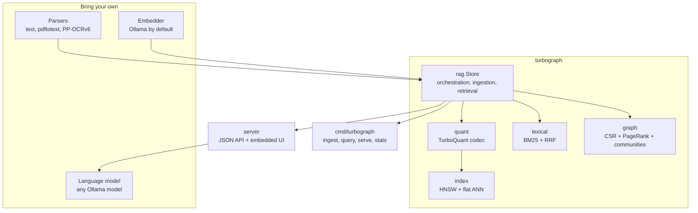
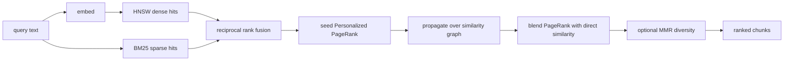
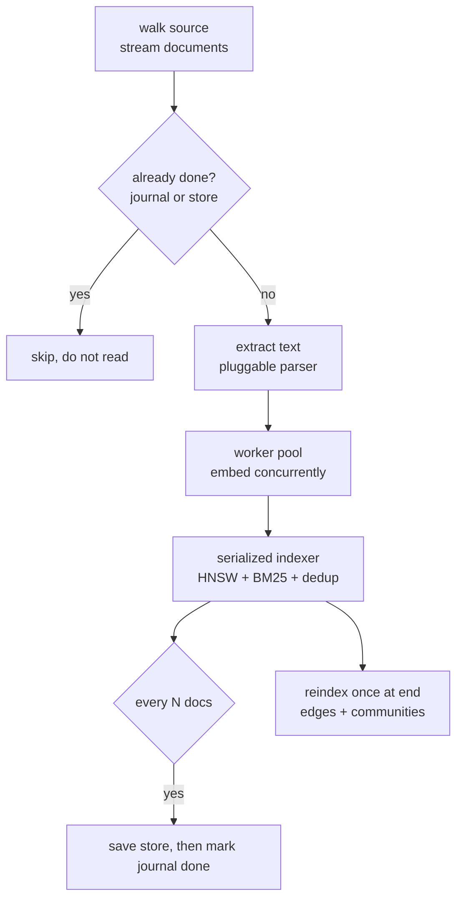

# turbograph

A fast, local, hackable graph RAG engine in Go.

turbograph is the retrieval layer: you bring documents, an embedding model, and
(optionally) a language model, and it gives you hybrid graph-aware retrieval over
a quantized vector index, a similarity graph, and a streaming chat UI. It runs as
a single self-contained binary with an embedded web interface and a single small
dependency (golang.org/x/sys, for SIMD CPU feature detection; build with
`-tags noasm` for a pure standard-library binary).

It is built to be taken apart. Every external dependency sits behind a small
interface, every algorithm lives in its own package usable on its own, and the
moving parts (embedder, parsers, vector index, graph, lexical search) are
swappable without touching the rest.

## What it does

- Quantizes embeddings with TurboQuant for compact storage and fast estimation.
- Indexes them in an HNSW graph for sublinear nearest-neighbor search.
- Indexes the text with BM25 for exact and rare-term matching.
- Connects chunks into a similarity graph and detects communities.
- Retrieves by fusing dense and sparse hits, seeding Personalized PageRank, and
  optionally diversifying with MMR.
- Serves a streaming chat UI with an interactive graph visualization, a command
  palette, and full keyboard control.
- Ingests at volume: parallel, resumable, crash-tolerant, with pluggable parsers
  including PDF and OCR.
- Dedupes by content hash and versions documents: re-uploading a changed document
  updates it in place and only re-embeds the chunks that changed.
- Persists to the local disk or any S3-compatible service, and isolates corpora
  into named buckets.

## Design goals

- Modular. Embedding, parsing, the vector index, the graph, and lexical search
  are separate packages behind small interfaces. Swap any of them.
- Local first. Embeddings and generation come from a local Ollama server. No
  data leaves the machine.
- Self-contained. One binary with the UI embedded; effectively zero
  dependencies (only golang.org/x/sys for SIMD detection).
- Fast. AVX SIMD distance kernels, hand-tuned hot paths, parallel ingestion,
  sublinear search.
- Honest. The README states what is approximate and what is exact.

## Architecture



Each core package is independently useful. `quant` is a standalone vector
quantizer, `index` is a standalone ANN index, `graph` is a standalone PageRank and
community library, `lexical` is a standalone BM25. `rag` composes them.

## Retrieval pipeline



The graph step is the point: a chunk that is one hop from a strong hit, but not
directly similar to the query, still receives mass and can be retrieved. That is
what makes it graph RAG rather than plain nearest-neighbor search.

## Ingestion pipeline

Built for volume: parallel embedding, per-document error isolation, a durable
journal for resume, periodic checkpoints, and a single graph rebuild at the end.



A document is marked done in the journal only after the store containing it has
been saved, so a "done" record always implies recoverable work. Re-ingestion is
idempotent (documents are deduped by id), so resuming after a crash or a pause
never duplicates or loses data. Interrupt with Ctrl-C to pause; re-run the same
command to resume.

## Quick start

Requires [Go](https://go.dev) 1.22+ and a running [Ollama](https://ollama.com).

```
ollama pull nomic-embed-text          # an embedding model
go build -o bin/turbograph ./cmd/turbograph

bin/turbograph serve --gen-model qwen3.5:2b
# open http://localhost:8080, drop in some .txt/.md/.pdf files, and chat
```

Or install the binary directly:

```
go install github.com/Gaurav-Gosain/turbograph/cmd/turbograph@latest
```

The binary embeds the entire web UI, so there is nothing else to deploy.

## The web UI

`serve` ships a self-contained interface (dark, JetBrains Mono, vanilla
JavaScript, no build step). It lets you:

- upload .txt, .md, and .pdf files, indexed incrementally,
- pick a local model and chat, with answers streamed and rendered as markdown,
- see retrieved chunks as source chips that highlight their nodes on hover and
  focus them on click,
- search the graph and watch matches light up,
- explore the similarity graph as an interactive force-directed map colored by
  community, with pan, zoom, drag, hover previews, and per-node detail.

It is built to be both approachable and fast to drive. Press `Ctrl K` for a
command palette, `/` to search the graph, `?` for help, and `Esc` to close or
stop. Retrieval settings live in a popover with plain-language explanations, and
a built-in "how it works" guide explains the pipeline.

## Storage

Buckets persist to the local filesystem by default (`serve --data <dir>`), or to
any S3-compatible service (AWS S3, MinIO, Cloudflare R2):

```
export AWS_ACCESS_KEY_ID=... AWS_SECRET_ACCESS_KEY=...
turbograph serve --s3-bucket my-bucket --s3-endpoint https://s3.us-east-1.amazonaws.com
```

The S3 client is implemented on the standard library with SigV4 signing, so there
is no AWS SDK dependency. Storage sits behind a small `storage.Blob` interface, so
adding another backend is one type.

## Command line

```
turbograph ingest --src <dir|file> --out store.tg [flags]   # parallel, resumable
turbograph query  --store store.tg --q "..." [--gen-model M] # retrieve or answer
turbograph serve  --store store.tg --addr :8080 [--gen-model M]
turbograph stats  --store store.tg
```

Run any subcommand with `-h` for its flags. Ingestion highlights:
`--workers` (concurrency), `--checkpoint` (crash-recovery interval),
`--pdf-cmd` and `--ocr-cmd` (swap parsers).

## PDF and OCR

PDF support is on automatically when `pdftotext` (poppler) is on PATH, which
handles text-based PDFs immediately. For scanned documents and images, wire an
OCR engine such as PaddleOCR PP-OCRv6 through `--ocr-cmd`. turbograph treats
extraction as an external command that reads a file and writes text, so any
parser works. See [docs/ingestion.md](docs/ingestion.md).

## Extending

turbograph is meant to be modified. See [docs/extending.md](docs/extending.md)
for how to:

- swap the embedder (implement one method),
- add or replace a parser (register an extractor by extension),
- use `quant`, `index`, `graph`, or `lexical` as standalone libraries,
- tune quantization, graph construction, and retrieval.

The deeper design is in [docs/architecture.md](docs/architecture.md).

## Performance

Measured on 16 cores, 768-dimensional embeddings, 4 bits per coordinate.

| operation                                   | result                |
| ------------------------------------------- | --------------------- |
| encode one vector (TurboQuant)              | about 74 microseconds |
| HNSW search recall at 10                     | 0.99+ at efSearch 64  |
| HNSW build per insert (clustered)            | about 0.8 ms          |
| flat quantized search, 1k / 10k / 50k       | 0.55 / 2.3 / 8.7 ms   |

The hottest function, the high-dimensional distance, is hand-tuned with multiple
accumulators and bounds-check elimination (profiled with pprof for a 1.8x build
speedup). Index scans and graph edge discovery run across all cores. Ingestion
embeds documents in parallel.

## Tests

```
go test ./...            # full suite
go test -race ./...      # race detector
go test -short ./...     # skip the slow recall and QPS sweeps
```

The Ollama and OCR dependent tests skip automatically when those tools are
absent. Everything else is self-contained: the codebook is checked against
textbook Lloyd-Max distortion, estimators against brute force, HNSW recall against
exact search, BM25 and RRF against known rankings, communities against modularity,
and ingestion (parallel, dedup, resume, error tolerance, cancellation) end to end.

## License

See [LICENSE](LICENSE).
