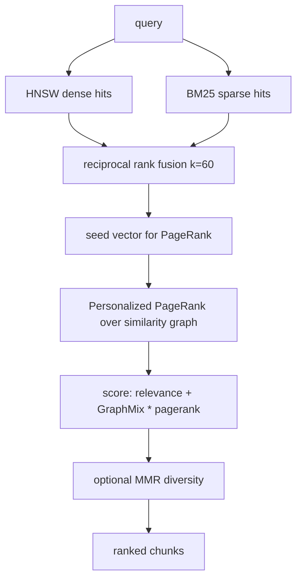
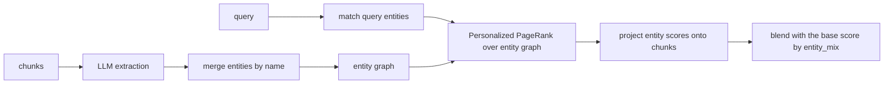
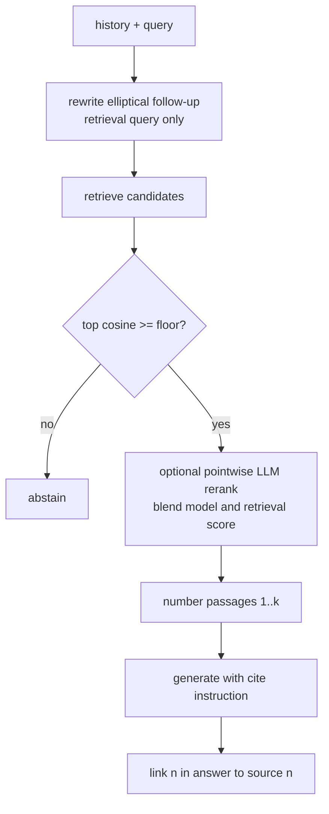
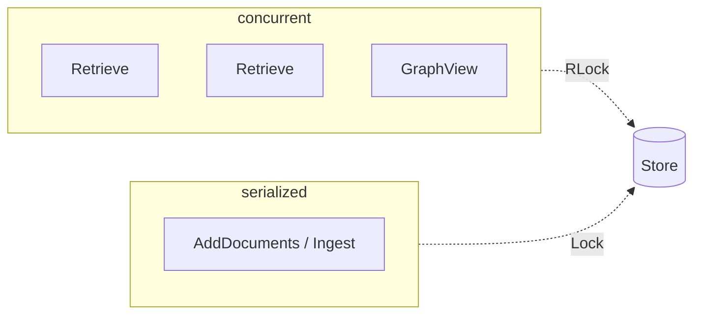

# Architecture

This document explains how turbograph works and why it is built the way it is.
The codebase is small and each package stands alone; read this alongside the
package doc comments and `go doc`.

## Packages

```mermaid
flowchart TB
  rag[rag<br/>store, ingestion, retrieval, persistence]
  quant[quant<br/>TurboQuant codec]
  index[index<br/>HNSW and flat ANN]
  lexical[lexical<br/>BM25 and RRF]
  graph[graph<br/>CSR, PageRank, communities]
  ollama[ollama<br/>embeddings and generation]
  extract[extract<br/>pluggable parsers]
  server[server<br/>JSON API, OpenAI /v1, embedded UI]
  mcp[mcp<br/>MCP stdio JSON-RPC]
  eval[eval<br/>retrieval metrics]
  cmd[cmd/turbograph<br/>CLI]

  rag --> quant
  rag --> index
  rag --> lexical
  rag --> graph
  index --> quant
  rag --> ollama
  server --> rag
  server --> ollama
  server --> extract
  cmd --> rag
  cmd --> server
  cmd --> extract
  cmd --> mcp
  cmd --> eval
  eval --> rag
```

`mcp` and `eval` are standalone too: `mcp` is a transport (it knows nothing about
retrieval; the CLI registers the tools), and `eval` scores any `retrieve` func.

`quant`, `index`, `graph`, and `lexical` have no dependency on `rag` or on each
other (except `index`, which encodes vectors with `quant`). They are usable as
standalone libraries.

## TurboQuant codec

TurboQuant (Zandieh, Daliri, Hadian, Mirrokni, 2025, arXiv:2504.19874) is a
data-oblivious vector quantizer with near-optimal distortion and no training.

```mermaid
flowchart LR
  V[vector] --> R[randomized Hadamard rotation]
  R --> N[store norm separately]
  R --> S[standardize to N(0,1)]
  S --> Q[Lloyd-Max scalar quantizer]
  Q --> C[per-coordinate code]
  Q --> RES[QJL 1-bit residual sketch]
```

1. A randomized Hadamard rotation spreads a vector's energy evenly across
   coordinates, so the coordinates of a unit vector become approximately
   independent Gaussians. The rotation is orthonormal, so it preserves inner
   products exactly. This is what lets a query stay full precision while the
   database is quantized (asymmetric distance computation).
2. The standardized coordinates are encoded by the Lloyd-Max optimal scalar
   quantizer for the standard normal, computed once at startup. The norm is stored
   separately.
3. A 1-bit QJL sketch of the quantization residual corrects the bias the
   MSE-optimal quantizer would otherwise add to inner-product estimates.

### Two estimators, on purpose

The QJL residual removes inner-product bias but injects the variance of a 1-bit
sketch. That variance helps when you need an accurate magnitude and hurts when you
only need an ordering. So the codec exposes both, and callers pick:

- `Score`, `CosineScore`, `L2Score`: the low-variance main term. Order-preserving,
  slightly biased in scale, best for ranking. In tests this gives perfect
  candidate recall at every bit rate.
- `IP`, `L2`, `Cosine`: the unbiased estimators with the residual correction, for
  when a magnitude must be accurate.

The HNSW index ranks on exact normalized float distance for top recall and keeps
the codes for the compact estimator path.

## HNSW index

A Hierarchical Navigable Small World graph gives sublinear search. The
implementation includes the SELECT-NEIGHBORS heuristic (keep a candidate only if
it is closer to the query than to any already-selected neighbor), which preserves
long-range connectivity and is the difference between a high-recall graph and a
fragmented one. It supports integrated pre-filtering: a predicate gates which
nodes enter the result set while traversal still expands through everything, so
metadata-filtered queries stay high-recall.

The hottest function is the high-dimensional distance. It is hand-tuned with eight
independent accumulators (to break the floating-point dependency chain) and
bounds-check elimination, which the profiler showed is most of build time; the
change was a 1.8x build speedup.

## Hybrid graph retrieval



The similarity graph connects each chunk to its nearest neighbors (plus
document-order edges). Seeding Personalized PageRank with the fused hits and
propagating means a chunk relevant by association, one hop from a strong hit, is
retrieved even with near-zero direct similarity. Communities are detected by label
propagation and exposed for thematic or global queries.

The graph signal is combined with direct relevance **additively**, not as a convex
blend: the score is `relevance + GraphMix * pagerank`. This is deliberate. A
convex blend (`mix * pagerank + (1-mix) * relevance`) makes PageRank centrality
trade directly against relevance, and at any substantial mix a high-centrality but
off-topic chunk displaces a genuinely relevant one, which collapses precision. The
additive form keeps a strong direct hit at the top and lets the graph only *lift*
associated chunks out of the tail, so it adds recall without sacrificing
precision. `GraphMix` defaults to a modest `0.2`; a negative value opts out of the
graph entirely for pure hybrid retrieval. This was measured on standard retrieval
benchmarks; see [benchmarks.md](benchmarks.md).

## Asymmetric embeddings

Modern embedding models are instruction-tuned and asymmetric: they are trained to
encode a search query and a stored passage with different prompts, and feeding
both the raw text leaves a large amount of retrieval quality unrealized. The
`ollama.Client` carries a `QueryPrefix` and a `DocPrefix`, set automatically from
the model name (`SetEmbedModel`) with documented presets for EmbeddingGemma, E5,
BGE, and Nomic. Documents are embedded with the document prompt at ingest; the
store embeds the query with the query prompt at search time through the optional
`QueryEmbedder` interface, falling back to the plain path for embedders that do
not distinguish. On SciFact this prompt difference alone is worth several points
of nDCG@10.

## Entity knowledge graph (optional)

The default graph connects chunks by similarity, which is fast and deterministic
but partly redundant with vector search. The `entity` package adds the GraphRAG
alternative: a language model extracts typed entities and relationships per chunk,
they are merged by name across chunks, and the result is an entity graph where
edges mean a stated relationship rather than similarity.



It is opt-in because extraction is one model call per chunk. Extracted entities
and relations are persisted in the snapshot, so the expensive step runs once. The
chunk-similarity graph is always available; the entity graph is an additional
signal, not a replacement.

## Grounding the answer

Retrieval produces ranked chunks; four optional steps sit between those chunks
and the generated answer. Each is independently switchable and the default path
runs none of them, so enabling one is a deliberate trade of latency for quality.



- **Query rewriting** (`rag` via the server) turns "what about its height?" into
  a standalone query using the recent turns, but only for retrieval; the model
  still answers the original message. It fires only when there is history and the
  message looks dependent, and falls back to the original on any weak rewrite.
- **The abstention gate** (`rag.ShouldAbstain`) compares the top hit's raw cosine
  similarity, an objective signal that is comparable across queries, against a
  floor. Below it, turbograph declines rather than answer from parametric memory.
- **Reranking** (`rag.Rerank`) issues one pointwise LLM call to score the
  candidates, then blends the normalized model score with the normalized
  retrieval score so the model refines rather than overrides. It is fail-open:
  any error or unparseable reply returns the base ranking, so it cannot regress.
- **Numbered citations** number the passages `[1..k]` in the prompt so the model
  cites positions the UI can resolve, rather than opaque chunk ids.

The same pipeline backs both the web chat and the OpenAI-compatible endpoint;
they share one helper so the two surfaces can never drift.

## The store

`rag.Store` is the orchestrator. It owns the quantizer, the HNSW index, the BM25
index, the chunks, their raw embeddings (the source of truth), the similarity
graph, and the communities. It is concurrency-safe for reads.

Ingestion separates the slow part (embedding, done off the write lock and in
parallel) from indexing (serialized) and from graph reconstruction (deferred to a
single reindex). Documents are deduped by id, which makes ingestion idempotent and
resume safe.

## Persistence

The on-disk format stores only what is expensive to recompute: the config, the
chunks, and their embeddings. The vector index, lexical index, similarity graph,
and communities are rebuilt deterministically on load. This keeps the format
small and immune to index-internal layout changes; loading is as fast as indexing
minus the embedding step, which is already done.

## Concurrency model



Reads take a read lock and run concurrently; writes take the write lock. The HNSW
visited-set is pooled per search so concurrent queries do not contend. The BM25
index is finalized under the write lock at build time so concurrent readers never
trigger its lazy mutation. The whole suite passes under the race detector.

## Why these choices

- Data-oblivious quantization means no training step and online updates.
- Storing raw embeddings and rebuilding indexes on load trades a little load time
  for a tiny, durable, forward-compatible format.
- Exact float distance in HNSW plus quantized codes gives both top recall and a
  compact estimator, rather than forcing one tradeoff.
- Deferring the graph rebuild keeps high-volume ingestion linear.
- A single dependency (golang.org/x/sys, for SIMD CPU detection) keeps the
  binary self-contained and trivial to distribute. Build with `-tags noasm` for
  a pure standard-library binary using the portable distance path.

## SIMD distance kernels

The high-dimensional distance is the hottest function in the engine. On amd64 it
uses a hand-written AVX kernel (four 256-bit accumulators, processing 32 floats
per iteration) selected at build time, with a portable Go fallback for other
platforms or `-tags noasm`. The AVX path is about 9x faster than the portable
version on 768-dimensional float32 vectors and is verified against it for every
length in tests, so the SIMD path can never silently diverge. This is the same
build-tag plus CPU-feature-detection pattern used across the rest of the
ecosystem.
