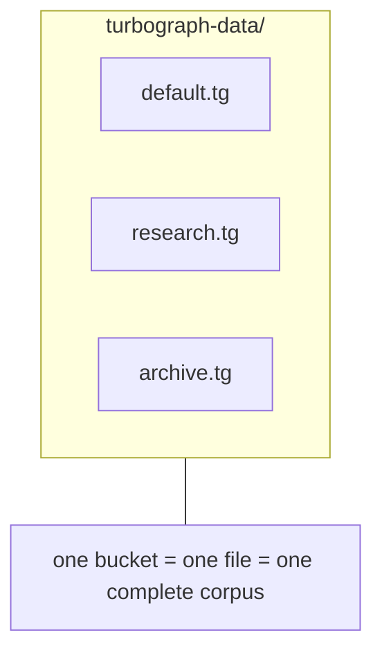

# The `.tg` store format

A `.tg` file is a complete turbograph corpus: its config, chunks, their
embeddings, per-document metadata, content history, and an optional entity graph,
in one portable file. Save one, copy it anywhere, load it, and you are back
exactly where you left off without re-embedding a thing. This document is the
format's specification: the wire encoding, every field, what is stored versus
rebuilt, the interop paths for other languages, and the rules for extending it.

## At a glance



A bucket is a `.tg` file. The server's data directory holds one file per bucket
(`<name>.tg`); the CLI reads and writes a single store path. Loading rebuilds the
search indexes from the stored embeddings, so the expensive step (embedding) is
never repeated.

## Encoding

A `.tg` file is a single [`encoding/gob`](https://pkg.go.dev/encoding/gob)
stream holding one `snapshot` value. There is no magic number, no header, no text
framing, and no version integer: the file is the gob encoding of the struct below
and nothing else.

gob is self-describing. The stream carries each field's name and type, so the
decoder matches fields by name and tolerates differences between the writer's and
reader's struct definitions:

- a field present in the file but absent in the reader's struct is skipped,
- a field absent in the file but present in the reader's struct reads as its zero
  value.

That is the entire compatibility story. A snapshot written by an older build
loads in a newer one, fields added later default to zero when absent, and there
is no explicit version to bump. The rules for keeping it that way are in
[extending the format](#extending-the-format).

## The snapshot struct

The encoded value (`rag/persist.go`). The JSON tag on each field is the key used
by the JSON export described [below](#interop-and-ffi); the Go field name is what
gob matches on.

```go
type snapshot struct {
    Cfg       Config                       `json:"config"`    // how this corpus was built
    Dim       int                          `json:"dim"`       // embedding dimension
    Chunks    []Chunk                      `json:"chunks"`    // the text, in ingestion order
    Embeds    [][]float32                  `json:"embeds"`    // raw embeddings, one per chunk
    Hashes    map[string][32]byte          `json:"hashes"`    // doc id -> content sha256 (dedup)
    Entities  []entity.Entity              `json:"entities"`  // entity graph nodes (optional)
    Relations []entity.Relation            `json:"relations"` // entity graph edges (optional)
    Versions  map[string][]docVersion      `json:"versions"`  // per-document content history
    DocMeta   map[string]json.RawMessage   `json:"doc_meta"`  // per-document metadata (raw JSON)
}
```

### Chunk

A `Chunk` (`rag/chunk.go`) is one unit of retrievable text with provenance:

```go
type Chunk struct {
    ID    string `json:"id"`     // stable identifier, "doc#pos"
    DocID string `json:"doc_id"`
    Pos   int    `json:"pos"`    // ordinal within the document
    Text  string `json:"text"`
    Start int    `json:"start"`  // rune offset of the body in the source, or -1
    End   int    `json:"end"`    // rune offset (exclusive), or -1
}
```

`Start` and `End` are the `[start, end)` rune offsets (not byte offsets) of the
chunk's body within the original document text. They give an exact
document-to-chunk mapping that callers use to render a document with its retrieved
chunks highlighted (see [primitives.md](primitives.md)).

The offsets are best-effort. At ingest, `chunkDoc` maps each piece back to the
source with `locateSpan` (`rag/document.go`), a whitespace-insensitive forward
scan: the built-in chunkers normalize whitespace (trim and join with single
spaces) and may prepend a markdown heading breadcrumb to `Text`, so an exact
substring match would fail. `locateSpan` matches the piece's non-whitespace runes
in order, treating any whitespace run on either side as a flexible separator, and
scans forward from the previous piece's start so overlapping pieces resolve in
document order. When a chunk's body cannot be located verbatim (for example a
custom `Chunker` that rewrites text), both `Start` and `End` are `-1`. The
breadcrumb that `chunkDoc` prepends to `Text` is not part of the located span; the
span covers only the original body.

### docVersion

Each entry in `Versions` is an immutable content snapshot (`rag/versions.go`),
recorded whenever a document is ingested or its content changes:

```go
type docVersion struct {
    Hash   [32]byte // sha256 of the content
    Time   int64    // unix seconds when recorded
    Text   string   // the full text of this version
    Chunks int      // number of chunks this version produced
}
```

The full text of every version is kept, so the UI can diff two versions and
restore an earlier one without the original file. Embeddings are not snapshotted
per version: a restore re-ingests the text through the normal update path, which
reuses existing embeddings for unchanged chunks. The newest entry is the live
document; `currentTextLocked` reads it as the document's current text.

## What is stored, and why

The format keeps only the inputs that are expensive to recompute and
deterministically rebuilds everything else on load.

| Field       | Holds                                                | Why it is (or is not) stored |
|-------------|------------------------------------------------------|------------------------------|
| `Cfg`       | chunking, quantization, HNSW, graph, and fusion knobs | so a reload reproduces the same build; a bring-your-own `Chunker` is **not** stored (it is code, not data) and is nulled out on save (`snap.Cfg.Chunker = nil`); only `Cfg.Chunk.Strategy` survives |
| `Dim`       | the embedding width                                  | to size the indexes before adding vectors |
| `Chunks`    | each chunk's id, doc id, ordinal, text, and offsets  | the source of truth for the lexical index, previews, and highlighting |
| `Embeds`    | one raw `float32` vector per chunk, in chunk order    | the source of truth for the vector index and MMR; storing these is what makes a reload skip embedding. `Embeds[i]` is the embedding of `Chunks[i]` |
| `Hashes`    | a content sha256 per document id                     | so content-level dedup survives a reload |
| `Entities`  | entity-graph nodes                                    | the entity graph is extracted with an LLM, far too costly to rebuild on load |
| `Relations` | typed, weighted edges between entities               | same reason; together with `Entities` it restores the GraphRAG graph |
| `Versions`  | each document's content snapshots                    | powers the version history, diffs, and restore; also holds the current full text per document |
| `DocMeta`   | arbitrary per-document metadata as raw JSON          | user data, independent of content; returned as-is to callers |

Everything derived is left out and rebuilt deterministically on `Load`: the
TurboQuant quantizer, the HNSW vector index, the BM25 lexical index, the
chunk-similarity graph, and the detected communities. This keeps the file small,
immune to index-internal layout changes, and forward-compatible. Loading costs
indexing time minus the embedding step (the part that talks to a model), which is
already done.

## Load and save (Go)

```go
// Save the current store.
f, _ := os.Create("research.tg")
store.Save(f)          // *Store.Save(io.Writer); refuses an empty store
f.Close()

// Load it back, attaching an embedder for future queries and ingestion.
f, _ = os.Open("research.tg")
store, _ = rag.Load(embedder, f)   // rag.Load(Embedder, io.Reader) (*Store, error)
f.Close()
```

`Save` takes any `io.Writer` and refuses to write an empty store. `Load` takes
any `io.Reader`, reconstructs the indexes from the stored embeddings, restores the
entity graph if present, and returns a store ready to query. The embedder you pass
to `Load` is only used for new queries and new documents; nothing already in the
file is re-embedded.

A program in another Go module can import the package directly and operate on a
`.tg` file:

```go
import "github.com/Gaurav-Gosain/turbograph/rag"
```

## Interop and FFI

gob is Go-specific: it is not a documented cross-language format and there is no
gob library for most languages. The supported, recommended interop path is the
JSON export, which transcodes the snapshot to plain indented JSON that any
language can read.

```sh
turbograph export --store research.tg --out research.json   # full JSON view
turbograph export --store research.tg --no-vectors          # omit embeddings (much smaller), to stdout
```

`cmdExport` (`cmd/turbograph/main.go`) streams the gob file straight through
`rag.ExportJSON` (`rag/persist.go`) without rebuilding any indexes, so no embedder
is needed. `--no-vectors` drops the `embeds` array, which dominates the size, when
only the text and structure are wanted. With no `--out`, the JSON goes to stdout.

### JSON schema

The exported JSON has exactly the snapshot's JSON keys:

| Key         | Type                       | Notes |
|-------------|----------------------------|-------|
| `config`    | object                     | the `rag.Config` used to build the corpus |
| `dim`       | integer                    | embedding dimension |
| `chunks`    | array of chunk objects     | `{id, doc_id, pos, text, start, end}` in ingestion order |
| `embeds`    | array of arrays of number  | `float32` embedding per chunk; `embeds[i]` matches `chunks[i]`. Omitted (null) with `--no-vectors` |
| `hashes`    | object: doc id -> bytes    | content hash per document; a `[32]byte` array serializes as a JSON array of 32 numbers |
| `entities`  | array of entity objects    | entity-graph nodes (empty if no entity graph was built) |
| `relations` | array of relation objects  | entity-graph edges |
| `versions`  | object: doc id -> array     | each element `{Hash, Time, Text, Chunks}` (the unexported `docVersion` marshals with its Go field names) |
| `doc_meta`  | object: doc id -> object   | the raw per-document metadata, verbatim |

A small example (vectors trimmed for brevity):

```json
{
  "config": { "Chunk": { "Strategy": "recursive", "TargetWords": 120, "OverlapWords": 24 } },
  "dim": 768,
  "chunks": [
    { "id": "intro.md#0", "doc_id": "intro.md", "pos": 0,
      "text": "Guide > Setup\nInstall the binary and run it.", "start": 0, "end": 41 }
  ],
  "embeds": [ [0.0123, -0.0456, 0.0789] ],
  "hashes": { "intro.md": [12, 244, 9, "..."] },
  "entities": [],
  "relations": [],
  "versions": {
    "intro.md": [ { "Hash": [12, 244, 9, "..."], "Time": 1718000000, "Text": "...", "Chunks": 1 } ]
  },
  "doc_meta": { "intro.md": { "source": "docs", "author": "rin" } }
}
```

### Reading a `.tg` file from another language

Two routes, in order of preference:

1. **Consume the JSON export (recommended).** Run `turbograph export` and parse
   the JSON with any library. Embeddings are `float32` arrays in chunk order, so
   chunk `i` pairs with `embeds[i]`. This is stable, language-agnostic, and the
   path the format is designed around.
2. **Reimplement the gob decode (advanced).** gob is a documented wire format
   (the [gob package doc](https://pkg.go.dev/encoding/gob) describes the
   encoding), so a determined consumer can decode the stream directly against the
   [snapshot struct](#the-snapshot-struct) above. This is awkward: gob is
   type-driven and self-describing in a Go-specific way, and you would be
   reimplementing a nontrivial decoder. Prefer the JSON export unless you have a
   strong reason not to.

Writing a `.tg` file is only supported from Go (`Store.Save`). Other languages
should produce documents and ingest them through the [HTTP API](primitives.md)
or the CLI, which writes the gob for you.

## Extending the format

The snapshot is forward- and backward-compatible as long as you follow gob's
matching rules. To add data to the format:

- **Only add fields.** A new optional field on `snapshot` is backward compatible:
  old files load with it at its zero value, and old builds skip it in new files.
- **Never reorder, retype, or remove a field.** gob matches by name, so order is
  irrelevant, but changing a field's type breaks decoding, and removing one drops
  the data silently. Renaming a field is effectively a remove plus an add.
- **Give it a JSON tag** if you want it in the export, and extend the
  [schema table](#json-schema) above.
- **Rebuild, do not store, anything derived.** If the new data can be recomputed
  from chunks and embeddings, rebuild it in `Load` instead of persisting it; that
  is what keeps the file small and layout-independent.

Remember that a custom `Chunker` is code, not data: it is nulled out on save, so
only `Cfg.Chunk.Strategy` round-trips. Reattach `Cfg.Chunker` after loading if you
ingest more documents with a bring-your-own splitter.

## Properties to rely on

- **Self-contained.** One file is one corpus. No sidecar files, no database.
- **Portable.** Copy it between machines; load it with any build that can decode
  the struct.
- **Embedding-free reload.** Loading costs indexing time minus the embedding step.
- **Forward-compatible.** New optional fields read as zero in older files; older
  files load in newer builds.

## Caveats

- The file is gob, not JSON. Read it with a turbograph build, the JSON export, or
  the Go `gob` package against the struct above; not a text editor.
- There is no encryption or checksum. Treat a `.tg` file like any other data file:
  the embeddings are derived from your source text, so handle it with the same
  care as the documents that produced it.
- A custom `Chunker` is not persisted; reattach it after loading.
