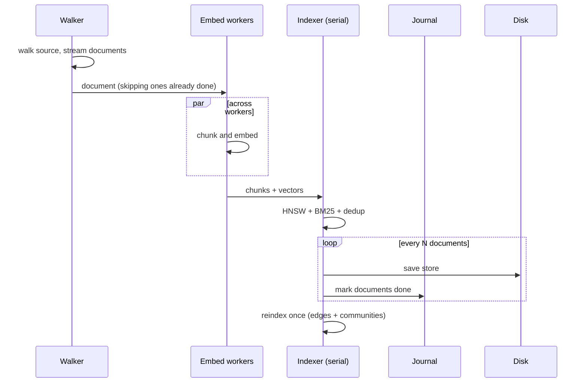
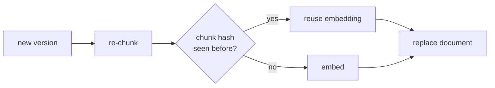
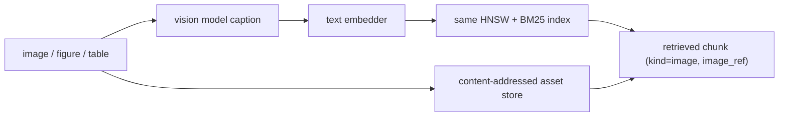

# Ingestion at volume

turbograph ingests large corpora with bounded parallelism, per-document error
isolation, durable resume, and pluggable parsers. This guide covers running it at
scale and wiring PDF and OCR.

## How it works



Embedding is the bottleneck, so it runs across a pool of workers
(`--workers`, default one per CPU). Indexing is serialized because HNSW insertion
is inherently sequential, but it is fast relative to embedding. The graph and
communities are rebuilt once at the end rather than per document, which keeps
ingestion linear rather than quadratic.

## Resume, crash recovery, and pause

The journal (a sibling file `<store>.journal`) records each document as done only
after the store containing it has been saved. Combined with id-based dedup in the
store, this gives three properties:

- Resume: re-running the same command skips documents already done, without
  re-reading or re-embedding them.
- Crash recovery: a crash loses at most the work since the last checkpoint
  (`--checkpoint`, default every 200 documents); nothing is duplicated or lost.
- Pause: press Ctrl-C once to stop cleanly after the current documents are
  checkpointed. Re-run to resume. Press Ctrl-C twice to abort immediately.

```
turbograph ingest --src ./big-corpus --out corpus.tg --workers 16 --checkpoint 500
# Ctrl-C to pause
turbograph ingest --src ./big-corpus --out corpus.tg --workers 16 --checkpoint 500
# resumes, skipping everything already ingested
```

Error tolerance is per document: a file that fails to parse or embed is recorded
and the run continues. Failures are retried on the next run.

## Deduplication and versioning

Documents are deduplicated by the SHA-256 of their content, so re-uploading the
same bytes (even under a different id) is a no-op, and the hash set is persisted
so dedup survives a restart.

When a document arrives with an id that already exists but with changed content,
it is treated as a new version. The document is re-chunked and diffed against the
current chunks by content hash: chunks whose text is unchanged keep their existing
embeddings, only the changed or new chunks are embedded, and chunks that
disappeared are removed. Because embedding is the expensive step, an edit to one
paragraph of a large document costs one embedding, not a full re-index.



## File types

Plain text (`.txt`, `.md`, `.markdown`, `.text`) is ingested directly. Other
formats are handled by external parsers, registered by extension. PDF is enabled
automatically when `pdftotext` (poppler) is present.

## PDF

For text-based PDFs, `pdftotext` is used by default. Override it if you prefer a
different tool:

```
turbograph ingest --src ./pdfs --out pdfs.tg \
  --pdf-cmd "pdftotext -layout -q {in} -"
```

`{in}` is replaced with the input file path; output is read from stdout. Use
`{out}` in the template instead if your tool writes to a file.

## OCR with PaddleOCR PP-OCRv6

For scanned PDFs and images, wire an OCR engine through `--ocr-cmd`. turbograph
ships an example wrapper at `scripts/paddleocr-extract.py` that prints recognized
text to stdout.

Install PaddleOCR in an isolated environment (a Python 3.12 interpreter is
recommended; paddlepaddle has no wheels for 3.13+ yet):

```
uv venv --python 3.12 ~/.turbograph-ocr
uv pip install --python ~/.turbograph-ocr/bin/python paddlepaddle paddleocr
```

Then point turbograph at the wrapper:

```
turbograph serve --ocr-cmd \
  "$HOME/.turbograph-ocr/bin/python /path/to/turbograph/scripts/paddleocr-extract.py {in}"
```

This registers OCR for `.pdf` and common image extensions
(`.png`, `.jpg`, `.jpeg`, `.tiff`, `.webp`). The default model is PP-OCRv6; the
first run downloads it. Set `PADDLE_LANG` to change language (default `en`). The
wrapper disables the oneDNN backend, which some CPU builds of paddlepaddle crash
in; remove that flag if your build is fine with it.

Anything that reads a file path and writes text to stdout works here. PP-OCRv6 is
one choice; swap in tesseract, a cloud OCR, or a document-AI service the same way.

OCR is for text trapped in a scan. To make an actual figure, chart, or table
retrievable as an image, use the multimodal path below instead.

## Images, figures, and tables (describe then embed)

turbograph makes images first-class retrievable content without a second vector
space. A vision model captions the image, the caption is embedded and indexed
like any other text, and the chunk keeps a reference to the stored image. A text
query then finds the figure by what it depicts.



This reuses the entire text pipeline: one embedding space, the same hybrid
search, graph, reranking, and persistence. The trade-off is that a caption is a
summary, so fine detail depends on the vision model; pick a capable one
(`llava`, `llama3.2-vision`, `qwen2.5-vl`, and similar).

The server stores image bytes in a content-addressed directory beside the
buckets (`<data>/assets`, enabled automatically when `--data` is set) and serves
them at `GET /api/asset/<id>`. The image bytes are never written into the `.tg`
snapshot, which stays text and vectors only.

Ingest an image over HTTP. `model` must name a vision-capable model the backend
can run; `meta` is optional document metadata:

```
POST /api/ingest/image
{ "id": "report.pdf#fig3", "b64": "<base64 image>", "ext": "png",
  "model": "qwen2.5-vl", "prompt": "Describe this figure for search.",
  "meta": { "source": "report.pdf", "page": 12 } }
```

The response carries the generated `caption` and the `image_ref`. From then on
the image retrieves by its caption, and a retrieved result reports `kind:
"image"` with its `image_ref` so a UI can show the picture (the bundled UI shows
it above the caption when you click the citation). In the web UI, dropping an
image file onto the upload zone runs the same path with the selected model.

A vision-capable backend is detected automatically; the Ollama backend
implements `CaptionImage` over the native `/api/generate` images field. To pull
figures out of PDFs, extract them with a poppler tool such as
`pdfimages -png in.pdf prefix` or `pdftoppm -png in.pdf prefix` and post each
image to the endpoint above, associating it with the PDF via the document id and
`meta`.

## Programmatic ingestion

The same engine is available as a library for streaming sources:

```go
docs := make(chan rag.Document)
go produce(docs) // close when done

journal, _ := rag.OpenJournal("corpus.tg.journal")
defer journal.Close()

prog, err := store.Ingest(ctx, docs, total, rag.IngestOptions{
    Workers:         16,
    Journal:         journal,
    Save:            func() error { return save(store, "corpus.tg") },
    CheckpointEvery: 500,
    OnProgress:      func(p rag.Progress) { log.Printf("%+v", p) },
})
```

Cancel `ctx` to pause; it checkpoints and returns `context.Canceled`.
