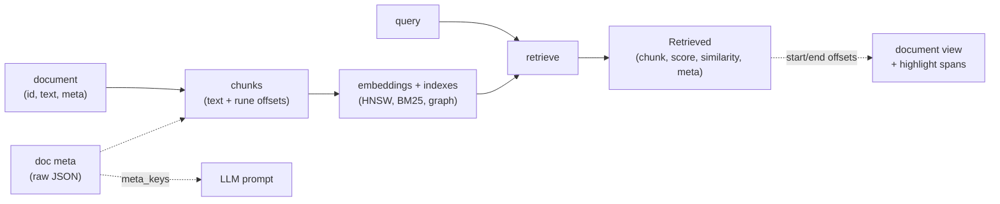

# Building on the primitives

turbograph is a small set of stable data primitives with a clean Go API and a
matching HTTP API. The store keeps documents, chunks, embeddings, metadata, and
version history; retrieval hands back scored chunks with their provenance. This
guide is for building your own tools, UI, or pipeline on top of those primitives
rather than around the bundled web app. For swapping the pieces underneath
(embedder, chunker, parser, backend), see [extending.md](extending.md).

Everything here is read- or write-stable: the Go types and the JSON shapes are
the contract. The bundled UI uses exactly these primitives, so anything it does,
you can do.

## The data flow



A document is split into chunks; each chunk records its `[start, end)` rune span
in the source. Chunks are embedded and indexed. A query retrieves scored chunks,
each carrying its source document's metadata. The offsets let you map a chunk back
onto the full document for highlighting; the metadata flows through to results and,
selectively, into the model prompt.

## Document metadata

Attach arbitrary metadata to a document and it rides along with every chunk and
every retrieved result. Metadata is stored as canonical JSON and returned as-is:
turbograph never interprets it, so you decide how to use it (parse it, filter on
it, feed selected fields to the model).

It is independent of content: a content-only update keeps the existing metadata,
and you can change metadata without re-ingesting.

**Go.** `rag.Document.Meta` is a `map[string]any`. Set it at ingest, or change it
later with `SetDocMeta`:

```go
store.AddDocuments(ctx, []rag.Document{{
    ID:   "rfc-7231",
    Text: body,
    Meta: map[string]any{"source": "ietf", "year": 2014, "tags": []string{"http"}},
}})

store.SetDocMeta("rfc-7231", map[string]any{"source": "ietf", "year": 2014})
raw := store.DocMeta("rfc-7231")   // json.RawMessage, or nil
```

Each retrieved result carries the source document's metadata as raw JSON:

```go
res, _ := store.Retrieve(ctx, "caching semantics", rag.RetrieveParams{TopK: 8})
for _, r := range res {
    var m map[string]any
    json.Unmarshal(r.Meta, &m)   // r.Meta is json.RawMessage; nil if none
}
```

**HTTP.** `POST /api/ingest/files` accepts a per-file `meta` object; `POST /query`
and `POST /api/chat` results include `meta` for each source. The chat request also
takes `meta_keys`, a list of metadata fields to inject verbatim into the model
prompt:

```sh
curl -X POST localhost:8080/api/chat -d '{
  "query": "what does it say about caching?",
  "meta_keys": ["source", "year"]
}'
```

`buildChatPrompt`/`selectMeta` (`server/web.go`) prefix the chosen fields to each
numbered passage as a compact `(source: ietf, year: 2014)` note. Absent keys are
skipped. The design is deliberate: metadata is raw and selected verbatim, so the
prompt content is yours to shape, not turbograph's.

## Chunk-to-document mapping and highlighting

Every chunk records the `[start, end)` rune offsets of its body in the source
document (`-1` when it could not be located; see
[format.md](format.md#chunk)). That mapping lets you render the whole document
with retrieved chunks highlighted in place, rather than showing isolated snippets.

**Go.** `DocumentView` returns the original text, the metadata, and a span per
chunk:

```go
view, ok := store.DocumentView("rfc-7231")
// view is rag.DocView{ ID, Text, Meta, Spans []ChunkSpan{ ID, Pos, Start, End } }
```

**HTTP.** `GET /api/document?doc=ID` returns the same `DocView` as JSON.

To highlight, walk the runes of `Text` and mark the ranges that retrieved chunks
cover. The bundled UI does exactly this in `openSource` (`server/static/index.html`):
it spreads the text into runes, marks each rune `2` for the clicked chunk and `1`
for any other retrieved chunk of the same document, then wraps marked runs in
`<mark>`. A minimal version:

```js
const view = await fetch(`/api/document?doc=${id}`).then(r => r.json());
const runes = [...view.text];
const mark = new Array(runes.length).fill(false);
for (const s of retrieved) {                 // results from /query or /api/chat
  if (s.doc_id !== id || s.start == null || s.start < 0) continue;
  for (let k = s.start; k < s.end && k < mark.length; k++) mark[k] = true;
}
// emit runes, wrapping contiguous marked runs in <mark>...</mark>
```

Offsets are rune indices, so spread to a rune array (`[...text]`) before slicing;
byte slicing would corrupt multibyte text.

## Delete a document

`DeleteDocument` removes a document and all of its chunks, drops its metadata and
version history, and rebuilds the indexes. It returns the number of chunks removed
(`0` if the document was not present).

**Go.**

```go
removed := store.DeleteDocument("rfc-7231")
```

**HTTP.** `DELETE /api/document?doc=ID` returns `{"deleted": ID, "chunks": n}`,
and the server persists the bucket.

## Version history

Every ingest or content change appends an immutable version (a repeat of the same
content hash is ignored, so re-ingesting identical text never pads the log). The
full text of each version is kept, so you can list, preview, diff, and restore
without the original files.

**Go.**

```go
vs := store.DocVersions("rfc-7231")          // []DocVersion{ N, Hash, Time, Bytes, Chunks, Current }, oldest first
text, ok := store.DocVersionText("rfc-7231", 2)  // full text of version 2 (1-based)
```

Restoring re-ingests an earlier version's text through the normal update
path: it appends a new version equal to the restored content (git-revert
semantics) and reuses embeddings for unchanged chunks.

**HTTP.**

- `GET /api/versions?doc=ID` lists the history.
- `GET /api/version?doc=ID&n=N` returns version `N`'s text.
- `POST /api/restore?doc=ID&n=N` makes version `N` live again.

## Retrieval

`Retrieve` runs hybrid graph retrieval and returns scored chunks. Each result
carries the chunk, a blended `Score`, the direct cosine `Similarity` to the query
(`0` if the chunk was not a dense seed), and the source document's `Meta`.

**Go.**

```go
res, _ := store.Retrieve(ctx, "caching semantics", rag.RetrieveParams{
    TopK:      8,
    GraphMix:  0,     // PageRank boost; off by default
    MMRLambda: 0,     // diversity tradeoff; 0 disables
    EntityMix: 0,     // entity-graph signal weight in [0,1]
})
// res is []rag.Retrieved{ Chunk, Score, Similarity, Meta }
```

The full `RetrieveParams` (`rag/store.go`) also exposes `SeedK`, `LexicalWeight`,
`PRF`/`PRFWeight`, `Filter`, and `PPR`; the defaults are tuned so the cheap path
is plain hybrid retrieval. See [extending.md](extending.md#tune-the-store) for the
knobs.

**HTTP.** Two surfaces, both backed by the same store:

- `POST /query` returns JSON results: `{id, doc_id, score, similarity, text,
  start, end, meta}` per chunk (the `queryResult` shape in `server/server.go`).
  The `start`/`end` offsets are there so you can highlight without a second call.
- `POST /api/chat` streams server-sent events: a `sources` event first (the same
  result shape), then `token` events with the generated answer, then `done` (or
  `abstain`/`error`). It accepts `top_k`, `graph_mix`, `mmr_lambda`,
  `entity_mix`, `min_sim`, `rerank`, `history`, `model`, and `meta_keys`.

```sh
curl -X POST localhost:8080/query -d '{"query": "caching semantics", "top_k": 8}'
```

Use `/query` when you want ranked chunks to process yourself; use
`/api/chat` when you want a grounded, cited answer streamed back.

## Pluggability seams

The primitives above are stable surfaces; the components underneath are swappable.
Rather than duplicate [extending.md](extending.md), here is the map:

- **Embedder** (`rag.Embedder`): any string-to-vector function.
- **Chunker** (`Config.Chunker`, or a named `Config.Chunk.Strategy`): how
  documents split. The named strategy persists; a custom `Chunker` does not.
- **Backend** (OpenAI-compatible or Ollama): generation and embedding endpoints.
- **Parsers** (`extract.Registry`): file-extension-keyed extractors for ingesting
  binary formats.

These compose under the same store and the same HTTP API, so a tool you build on
the primitives keeps working when you swap a component beneath it.
